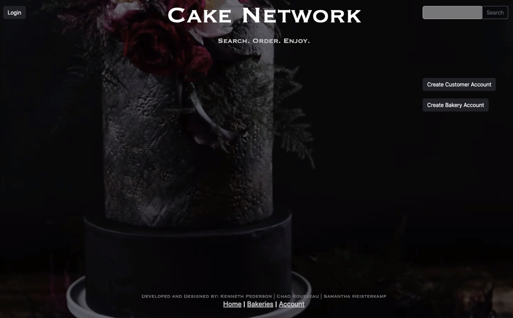
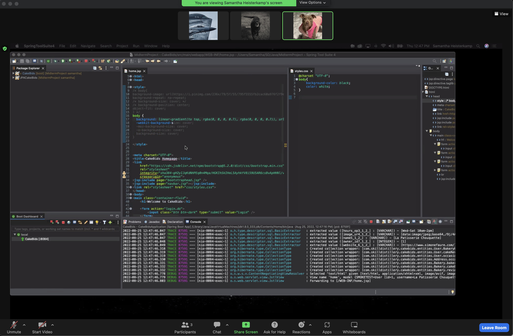
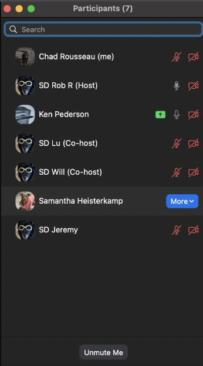
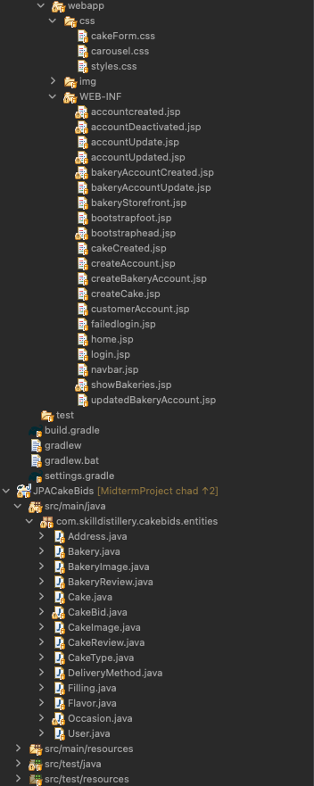

# CakeNetwork

## Authors

 Samantha Heisterkamp (Developer, DBA) 

 Chad Rousseau (Developer, Scrum Master) 

 Ken Pederson (Developer, Repo Owner) 

## Overview

The CakeBids application, in its current state, is designed to interlink customers with artisan cake bakery's. A customer is able to fill out a cake order form and submit it to their desired bakery. The Bakery is then able to track its orders, the customers contact information and the details of the venue for the occasion the cake is for.

The CakeBids application, as originally envisioned, would also allow a user to post a cake request, allowing bakery's to bid on their requests which the customer could then select the winning bid. The customer would also be able to leave a review for a bakery and later be able to either update their review or delete it. The Bakery would have a list of all their customer reviews and be able to post their own response to individual reviews. Finally, these reviews would be listed for potential customers to read on the bakery web site. Evidence of our intent for these features can be found in our database schema below. Our time-constraint for this mid-term project proved to be an excellent exercise in constant re-evaluation of priorities through the Agile methodology. 

If you would like to login to our site without having to create an account just use the following information. Otherwise, please feel free to visit our site using the link below!
* User name: visitor
* Password: 1234

<a href="http://34.206.35.233:8080/CakeBids/home.do">Click Here to Visit Our Midterm Project Site</a></>

## Description

When a user visits the applications web site, the home page presents several options. A user can create a customer account, log in as a customer or visit cake bakery store front sites. Also,  a user can create a bakery account or login as a bakery-type user. If a visitor to the site only wants to see the bakeries that are registered members of the site, they can either search for bakeries by keyword or click a link that shows a list of all the bakery's on another page. 

The customer, once logged in, is presented with their account page. The account page gives the customer the option to search for bakeries by keyword, show a list of bakeries, order a cake, update their account, logout or delete their account. Should a user choose to "delete" their account, the account will simply become inactive rather than being removed from the database. When a user chooses to order a cake, they are presented with a form which gathers the required information. First, it asks for the details of the occasion that the cake is being made for, it's location and the best phone number for the bakery to contact should there be any questions about the occasion or the cake itself. Next, the form has multiple inputs for the customer to describe their cake to give the bakery a vision to follow when designing the cake, followed by specific properties of the cake. Finally, the user is presented with their desired budget for the bakery to work within, the date for the cake to be ready by and any special instructions. This section is concluded with users auto-filled first name, last name and phone number. The phone number serves as an alternative number to the provided occasion phone number, should the bakery need to use if the phone number for occasion's information becomes unreachable. Once submitted, the cake order is transferred to the bakery specified by the customer in the cake order form. Each bakery's account page features a table that lists each order they've been given.

The bakery user, once logged in, is presented with their account page. The account page is comprised of a list of their orders, an option to log out, update their account or delete their account. As with the customer account, choosing the option of "delete" will simply change the account from active to inactive. The bakery has all the information it needs to build the cake and reach out to the customers for any interaction required to complete the order. The bakery now also has a record of their orders they can refer to for reaching out to customers for potential repeat business such as annual occasions like a birthday or anniversary.

The original why...

Our intent for our mid-term project was to build an application that would allow for customers to post biddable requests or direct orders to bakery's for cakes. This would create a competitive environment between bakery's that would be tempered by the reviews of the customers and managed by an administrator. Also, we wanted to create a malleable project that could easily be translated from the artisan craft of cake making to another similar craft such as candle makers, glass blowers, or beard oil products producers. Given the time constraints of a week and a half to accomplish this from-the-ground-up application, the ability for customers to send orders to a bakery is what our team achieved through applying the Agile methodology from start to finish. 

## Methodologies

It's all about Agile.

Planning
* Before each day began, the Trello board was updated for any adjustments required for new requirements and/or realignment of priorities based on time remaining. From there, Chad conducted his daily scrum meeting to baseline the team and confirm priority's and their assignment to team members. Priorities reflected the order presented by the Trello board (phases distinguished by user stories). 

Executing
* The entire rest of the day was conducted with constant communication amongst the team and the stakeholders (Skill Distillery staff) via Zoom. Our standard process was for two team members to pair-program while the other worked another priority. When either the pair-programming team or the solo programmer would encounter a blocker, the team would swarm as a whole until the issue was resolved. When the issue could not be resolved within the team, we called upon the "stakeholders".    

  

Evaluating
* Evaluation often occurred in real time as the clock continued to click and blockers consumed more time than expected. The decision making, based on our observations through the day, would be discussed at the end of the day for how to adjust our applications features into a "stretch goal" category. Before the morning official start time, the Trello board would already be adjusted to reflect the teams evaluation of features to prioritize. To say "constant collaboration" was key, is an understatement.

## Implementation Tools

The structure of this application began with Trello. Each user story was created, color-coded and given a description. Simultaneously, our team used a web site, Blasamiq, to build our wire frame. Trello and Balsamiq both worked pricelessly to inform the next Trello card we needed to create, feature to add to the wire frame or adjustments we might need to implement in Samantha's database to achieve the desired result. Most importantly, Trello and the wire frame kept us grounded with where we were and the work ahead of us. With this frame of reference, we were able to make decisions very early on for what user stories would need to be recategorized as a stretch goal and which user stories were critical given our limited time frame to produce a viable application. 

* Our Trello Board As We Transitioned To CSS and Bootstrap Implementation

* Our Final Wire Frame After Many AdjustMents To Our User Stories Were Made

With our first-draft Trello board and wire frame in hand we built a database to reflect our needs to make our user stories a reality. Starting with the User (orange table, top-left in the image), we begin a "HAS-A" chain of events completing a full circle...
1. A user has an occasion
2. An occasion has a cake
3. A cake has a delivery method, a type, a filling, a flavor and an image.
4. A cake has an agreement with the bakery through a "cake bid" which serves to fulfill direct orders (current implementation) and bids by bakeries (not implemented at this time).
5. Finally, a cake has a Bakery that creates it.
6. A Bakery is a user. 

* Our Database Schema

## Lessons Learned

Keeping situational awareness is provided through the Agile methodology 
	* Because of our Trello board and constant communication, we had a visual representation at all times of how far we had to go. This "reality check" allowed us to see far in advance that adjustments had to be made to achieve a viable product. The plan molded to the new reality each day through team collaboration. The Trello board was updated to reflect the agreed upon changes thereby preventing confusion on what we needed to do next as a team.
	
Branching with Git & Github
	* This project represents the first experience of each team member with branching and it proved to be vital to our success and gave each of us critical familiarity and confidence with how to use branching and why it's so important. With our teams constant communication, each team member was aware of each branch merge event with main so they would know when to pull. Before doing so, however, the integrity of the code from the members personal branch was confirmed before it was allowed to be merged. Each step of the merge process was walked through each time as a team for the member performing the merge and for the other members pulling the new data into their own branch. The same process was followed each time Samantha performed her database administrator functions with the added step of ensuring everyones version of the database was updated on their computer.

Learning through the struggle
	* Troubleshooting became second nature to recognize problems with our database values versus our mappings of the entities with each other. As we progressed with establishing relationships between the tables, we learned to adjust initial variables to the corresponding data type being linked with the table. If we omitted this change, the JUnit tests would result in an immediate termination and no test results would be produced. We quickly learned the error most likely was due to omitting a change of the variable to the object being linked. After pair programming for several hours, writing code and troubleshooting became more and more challenging. They key to pressing forward through blockers was to find different ways to view the problem, either through the ERDiagram or previous code that tackled the same problem. Changing perspective is key.
	* Building a complex application from the ground up combined with long hours of grinding causes accelerated diminishing returns. By the last hour of the class day, the team collectively would begin to experience more difficulty in writing code and producing the desired results. Typically, the next morning would go much smoother with fresher minds. Calling it a day and walking away is often wiser than sticking to the grind. 
	* No one person has the answer, but the team does. Our team experienced blockers that even our most seasoned instructor was temporarily baffled by. Students and staff alike, working through a problem by voicing their thoughts and questions, "googling" on their own computer ALWAYS led to the way forward. 

## Technologies 

* AWS- EC2
* Bootstrap
* CSS/HTML
* Git
* GitHub
* Gradle
* Java 
* JDBC
* JPA 
* MySQL Workbench
* SpringToolSuite4
* Spring Boot
* Spring MVC
* Terminal -zsh
* Zoom

## A Few Screen shots taken during our application creation journey

* Finally implementing CSS!  

* Swarming on Zoom with the Skill Distillery Staff (bringing in the big guns)! 

* A small portion of our file tree in SpringToolSuite4

