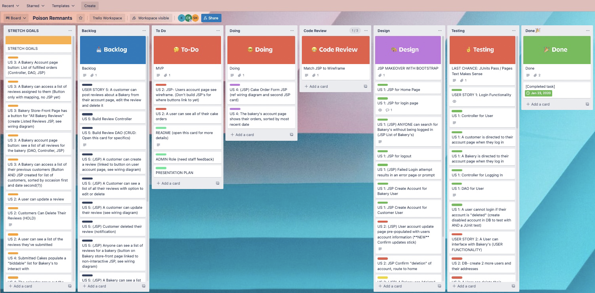
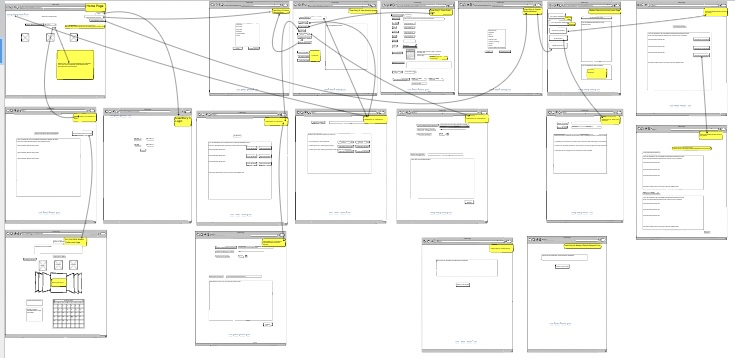
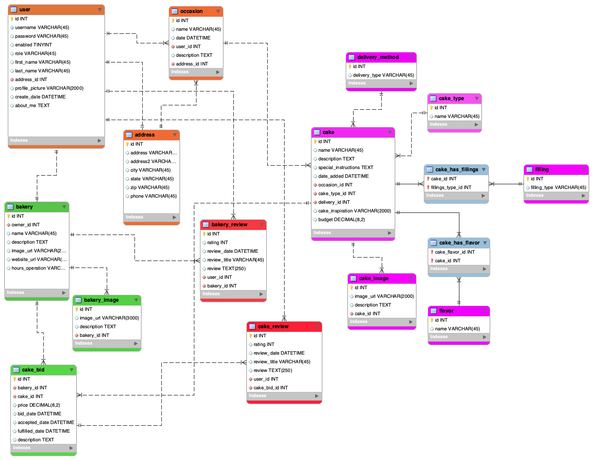

# CakeBids

## Authors

   Samantha Heisterkamp (Developer, DBA) 

   Chad Rousseau (Developer, Scrum Master) 

   Ken Pederson (Developer, Repo Owner) 

## Overview

The CakeBids application, in its current state, is designed to interlink customers with artisan cake bakery's. A customer is able to fill out a cake order form and submit it to their desired bakery. The Bakery is then able to track its orders, the customers contact information and the details of the venue for the occasion the cake is for.

The CakeBids application, as originally envisioned, would also allow a user to post a cake request, allowing bakery's to bid on their requests which the customer could then select the winning bid. The customer would also be able to leave a review for a bakery and later be able to either update their review or delete it. The Bakery would have a list of all their customer reviews and be able to post their own response to individual reviews. Finally, these reviews would be listed for potential customers to read on the bakery web site. Evidence of our intent for these features can be found in our database schema below. Our time-constraint for this mid-term project proved to be an excellent exercise in constant re-evaluation of priorities and maintaining constant communication amongst team members as we selected user stories to become stretch goals as time grew short.

## Description

* URL to the programs site

* How Our Application Works

When a user visits the applications web site, the home page presents several options. A user can create a customer account, log in as a customer or visit cake bakery store front sites. Also,  a user can create a bakery account or login as a bakery-type user. If a visitor to the site only wants to see the bakeries that are members of the application, they can either search for bakeries by keyword or click a link that shows a list of all the bakery's on another page. 

The customer, once logged in, is presented with their account page. The account page gives the customer the option to search for bakeries by keyword, show a list of bakeries, order a cake, update their account, logout and delete their account. Should a user choose to "delete" their account, the account will simply become inactive. When a user chooses to order a cake, they are presented with a form gathers the require information. First it asks for the details of the occasion that the cake is being made for, it's location and the best phone number for the bakery to contact should there be any questions about the occasion or the cake itself. Next, the form has multiple inputs for the customer to describe their cake to give the bakery a vision to follow when designing the cake, followed by specific properties of the cake. Finally, the user is presented with their desired budget for the bakery to work within, the date for the cake to be ready by and special instructions. This section is concluded with users auto-filled first name, last name and phone number. Here theses aspects of their account should any changes need to be made. The phone number especially serves as an alternative number for the bakery to reach out to if the phone number for occasion's information become unreachable. Once submitted, the cake order is transferred to the bakery specified by the customer in the cake order form. Each bakery's account page features a table that lists each order they've been given.

The bakery user, once logged in, is presented with their account page. The account page is comprised of a list of their orders, an option to log out, update their account or delete their account. As with the customer account, choosing the option of "delete" will simply change the account from active to inactive. The bakery has all the information it needs to build the cake and reach out to the customers for any interaction required to complete the order.

* The why. 
Our intent for the mid-term project was to build an application that would allow for customers to post requests or direct orders to bakery's for cakes. This would create a competitive environment between bakery's that would be tempered by the reviews of the customers. Also, our a malleable project that could easily be translated from the artisan craft of cake making to another similar craft such candle makers or beard oil products. Given the time constraints of a week and a half to accomplish the functionality, the ability for customers to post orders is what our team was able to achieve. 

* Screen shots 

* instructions on how to log in to the site

## Implementation

The structure of this application began with Trello. Each user story was created, color-coded and given a description. Simultaneously, our team used a web site, Blasamiq, to build our wire frame. Trello and Balsamiq both worked pricelessly to inform the next Trello card we needed to create, feature to add to the wire frame or adjustments we might need to implement in our database to achieve the desired result. Most importantly, Trello and the wire frame kept us grounded with where we were and the work ahead of us. With this frame of reference, we were able to make decisions very early on for what user stories would need to be recategorized as a stretch goal and which user stories were critical given our limited time frame to produce the application. 

* Our Trello Board As We Transitioned To CSS and Bootstrap Implementation

* Our Final Wire Frame After Many AdjustMents To Our User Stories Were Made

With our first-draft Trello board and wire frame in hand we built a database to reflect our needs to make our user stories a reality. Starting with the User, we begin a "HAS-A" chain of events completing a full circle...
1. A user has an occasion
2. An occasion has a cake
3. A cake has a delivery method, a type, a filling, a flavor and an image.
4. A cake has an agreement with the bakery through a "cake bid" which serves to fulfill direct orders (current implementation) and bids by bakeries (not implemented at this time).
5. Finally, a cake has a Bakery that creates it.
6. A Bakery is a user. 

* Our Database Schema

## Lessons Learned

Trello- Keep highest level on the User Story and write out sub cards that get you to the User Story completion.

Keeping the path clear: A morning routine of organizing the Trello board kept the team on the same page and focused on the right priorities. The first iteration of the Trello board featured every possible facet of the application we could imagine. Howe Refactoring of the user stories was especially important as time for completing the project on time and achieving an MVP (minimum viable product)

* MileStone 3 LL: Troubleshooting became second nature to recognize problems with our database values versus our mappings of the entities with each other. As we progressed with establishing relationships between the tables,  we learned to adjust initial variables to the corresponding data type being linked with the table. If we omitted this change, the JUnit tests would result in an immediate termination and no test results. We quickly learned the error most likely was due to omitting a change of the variable to the object being linked. After pair programming for several hours, writing code and troubleshooting became more and more challenging. They key to pressing forward through blockers was to find different ways to view the problem, either through the ERDiagram or previous code that tackled the same problem. Changing perspective is key.

*   

## Technologies 

* Bootstrap
* HTML/CSS
* JPA 
* MySQL Workbench
* Spring MVC

## Methodologies

*scrum, agile, Trello, Balsamic wire frame, etc. 

## Getting Started (How to install)

### Prerequisites

### Installing

### Running the Application

## Acknowledgments
* OPTIONAL