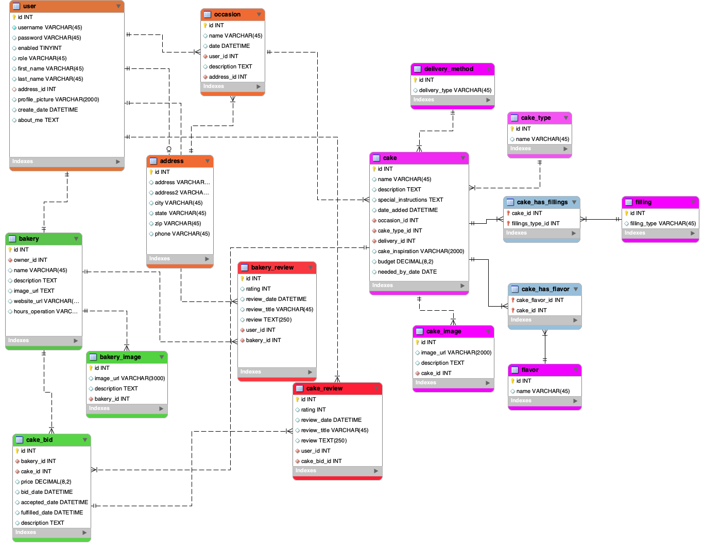

# CakeBids

## Authors
* Samantha Heisterkamp (Developer, DBA)
* Chad Rousseau (Developer, Scrum Master)
* Ken Pederson (Developer, Repo Owner)

## Overview
The CakeBids application, in its current state, is designed to interlink customers with artisan cake bakery's. A customer is able to fill out a cake order form and submit it to their desired bakery. The Bakery is then able to track its orders, the customers contact information and the details of the venue for the occasion the cake is for.

## Description

* URL to the programs site

* How Our Application Works

When a user visits the applications web site, the home page presents several options. A user can create a customer account, log in as a customer or visit cake bakery store front sites. Also,  a user can create a bakery account or login as a bakery-type user. If a visitor to the site only wants to see the bakeries that are members of the application, they can either search for bakeries by keyword or click a link that shows a list of all the bakery's on another page. 

The customer, once logged in, is presented with their account page. The account page gives the customer the option to search for bakeries by keyword, show a list of bakeries, order a cake, update their account, logout and delete their account. Should a user choose to "delete" their account, the account will simply become inactive. When a user chooses to order a cake, they are presented with a form gathers the require information. First it asks for the details of the occasion that the cake is being made for, it's location and the best phone number for the bakery to contact should there be any questions about the occasion or the cake itself. Next, the form has multiple inputs for the customer to describe their cake to give the bakery a vision to follow when designing the cake, followed by specific properties of the cake. Finally, the user is presented with their desired budget for the bakery to work within, the date for the cake to be ready by and special instructions. This section is concluded with users auto-filled first name, last name and phone number. Here theses aspects of their account should any changes need to be made. The phone number especially serves as an alternative number for the bakery to reach out to if the phone number for occasion's information become unreachable. Once submitted, the cake order is transferred to the bakery specified by the customer in the cake order form. Each bakery's account page features a table that lists each order they've been given.

The bakery user, once logged in, is presented with their account page. The account page is comprised of a list of their orders, an option to log out, update their account or delete their account. As with the customer account, choosing the option of "delete" will simply change the account from active to inactive. The bakery has all the information it needs to build the cake and reach out to the customers for any interaction required to complete the order.

* The why. 
Our intent for the mid-term project was to build an application that would allow for customers to post requests or direct orders to bakery's for cakes. This would create a competitive environment between bakery's that would be tempered by the reviews of the customers. Also, our a malleable project that could easily be translated from the artisan craft of cake making to another similar craft such candle makers or beard oil products. Given the time constraints of a week and a half to accomplish the functionality, the ability for customers to post orders is what our team was able to achieve. 

* Screen shots 

* instructions on how to log in to the site

## Implementation

* Description of the project structure

* image of the wire frame

* image of Trello

* image of the ERDIagram

## Lessons Learned

Trello- Keep highest level on the User Story and write out sub cards that get you to the User Story completion.

* MileStone 3 LL: Troubleshooting became second nature to recognize problems with our database values versus our mappings of the entities with each other. As we progressed with establishing relationships between the tables,  we learned to adjust initial variables to the corresponding data type being linked with the table. If we omitted this change, the JUnit tests would result in an immediate termination and no test results. We quickly learned the error most likely was due to omitting a change of the variable to the object being linked. After pair programming for several hours, writing code and troubleshooting became more and more challenging. They key to pressing forward through blockers was to find different ways to view the problem, either through the ERDiagram or previous code that tackled the same problem. Changing perspective is key.  

## Technologies 

* Bootstrap
* HTML/CSS
* JPA 
* MySQL Workbench
* Spring MVC

## Methodologies

*scrum, agile, Trello, Balsamic wire frame, etc. 

## Stretch Goals

* Display bakers images with a carousel
* List bakers by nearest geographical proximity to customer 
* A bakery can can search bid requests by the occasion type (requires drop-down selection for occasions in the cake bid form)
* README incorporates images
* README incorporates video

## Getting Started (How to install)

### Prerequisites

### Installing

### Running the Application

## Acknowledgments
* OPTIONAL